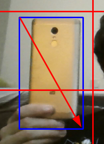

# Python-DOOM-With-Camera
(An alternative camera playable version of) [Raycasting DOOM imitation](https://github.com/StanislavPetrovV/Python-DOOM)

# How to Play

In order to play this iteration of DOOM, you must first decide on what the tracker will actually track. You must then put the object in the camera's range (the closer, the better) and drag your mouse from the top right of the object to the bottom left, like shown in the picture.

Then, without moving the object, you must hold Q for the tracker to adapt to that object, after that you should be good to go.
If the tracker ever goes off course (which it will), you may do this process again.
## Controls

