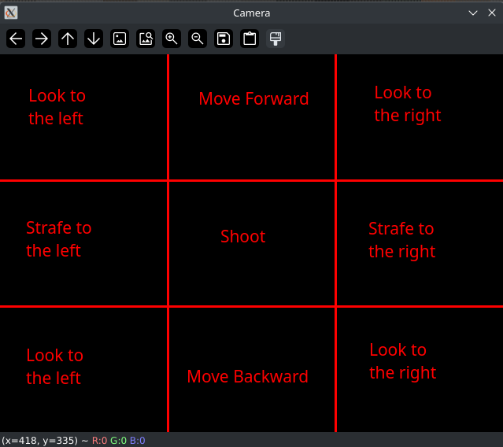

# Python-DOOM-With-Camera
(An alternative camera playable version of) [Raycasting DOOM imitation](https://github.com/StanislavPetrovV/Python-DOOM)

# How to Play

In order to play this iteration of DOOM, it is necessary that you have a pair of scissors and a cell phone in order for them to be detected by the camera.
The player is controlled by the position of the scissors and is able to shoot by having a cellphone being detected anywhere in the camera's view.

## Controls

